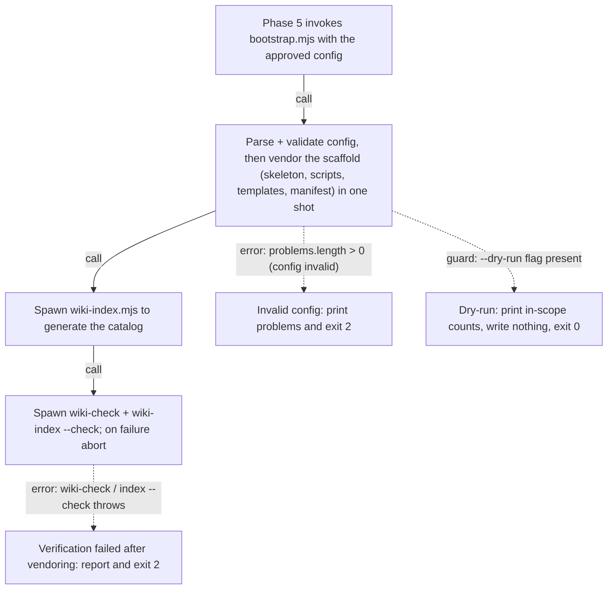

# Flow: bootstrap-vendoring — config to verified scaffold

> One named scenario: **init turns an approved config into a verified vendored
> scaffold.** This is the v1 dogfood flow page — the diagram and tables below
> the marker are *generated* from the `flow_*` frontmatter by
> `wiki-flow-render.mjs`; never hand-edit them. Anchors live in the tables, not
> the diagram (GitHub strips Mermaid links). See `references/flow.md` for the
> schema and the verification ladder.

## Scenario

After the plan-approval gate (init phase 4), all judgement is encoded in the
config file and the vendoring is one mechanical shot: `references/init.md`
phase 5 invokes `scripts/bootstrap.mjs`, which parses and validates the config,
creates the wiki skeleton, copies the vendored scripts, instantiates the
templated files, writes the blob-SHA manifest, then **spawns** `wiki-index.mjs`
and `wiki-check.mjs` to verify its own output before reporting. Two branches
divert the happy path: an invalid config aborts early, and `--dry-run` previews
the in-scope counts without writing.

<!-- FLOW-RENDER:START — generated from flow-meta; do not hand-edit (run wiki-flow-render.mjs) -->

| # | Step | Actor | Anchor |
|---|------|-------|--------|
| 1 | invoke — Phase 5 invokes bootstrap.mjs with the approved config | init-skill | `references/init.md` — `scripts/bootstrap.mjs --config` |
| 2 | run-bootstrap — Parse + validate config, then vendor the scaffold (skeleton, scripts, templates, manifest) in one shot | bootstrap | `scripts/bootstrap.mjs` — `copyFileSync(join(PLUGIN_SCRIPTS` |
| 3 | generate-index — Spawn wiki-index.mjs to generate the catalog | bootstrap | `scripts/bootstrap.mjs` — `wiki-index.mjs'` |
| 4 | verify — Spawn wiki-check + wiki-index --check; on failure abort | bootstrap | `scripts/bootstrap.mjs` — `wiki-check.mjs'` |
| 5 | report-invalid — Invalid config: print problems and exit 2 | bootstrap | `scripts/bootstrap.mjs` — `if (problems.length) fail` |
| 6 | dry-run-preview — Dry-run: print in-scope counts, write nothing, exit 0 | bootstrap | `scripts/bootstrap.mjs` — `argv.includes('--dry-run')` |
| 7 | report-verify-fail — Verification failed after vendoring: report and exit 2 | bootstrap | `scripts/bootstrap.mjs` — `verification failed after vendoring` |

**Edges** — each `verified` hop cites the call site in the caller and names the callee:

| From → To | Kind | Evidence | Call site | Callee |
|-----------|------|----------|-----------|--------|
| invoke → run-bootstrap | call | verified | `references/init.md:151` — `scripts/bootstrap.mjs --config` | `bootstrap.mjs` |
| run-bootstrap → generate-index | call | verified | `scripts/bootstrap.mjs:252` — `join(scriptsDir, 'wiki-index.mjs')` | `wiki-index.mjs` |
| generate-index → verify | call | verified | `scripts/bootstrap.mjs:254` — `join(scriptsDir, 'wiki-check.mjs')` | `wiki-check.mjs` |

**Branches** — alternative and error paths:

| At → To | Kind | Condition | Cited at |
|---------|------|-----------|----------|
| run-bootstrap → report-invalid | error | problems.length > 0 (config invalid) | `scripts/bootstrap.mjs:111` — `if (problems.length) fail` |
| run-bootstrap → dry-run-preview | guard | --dry-run flag present | `scripts/bootstrap.mjs:61` — `argv.includes('--dry-run')` |
| verify → report-verify-fail | error | wiki-check / index --check throws | `scripts/bootstrap.mjs:258-259` — `verification failed after vendoring` |

<!-- FLOW-RENDER:END -->

## Why these edges are `verified`

Each hop cites the **call site in the caller's own code** and names the callee:
`init.md` literally runs `bootstrap.mjs --config`; `bootstrap.mjs` literally
spawns `wiki-index.mjs` and `wiki-check.mjs`. The sequential operations *inside*
the vendoring (mkdir → copy → instantiate → manifest) are collapsed into the
`run-bootstrap` step deliberately — they are statement order, not calls, and a
flow page is schematic, not a line-by-line transcript (arc42 §6).

## Completeness

`flow_asserts_complete: false` — this page makes no claim that it captures
*every* branch of `bootstrap.mjs`. Set-equality completeness checking is
available as an opt-in user-space extractor (see `references/flow.md`); without
one registered, the page honestly tops out at `branch-audited` and the
omitted-branch heuristic is advisory only.
