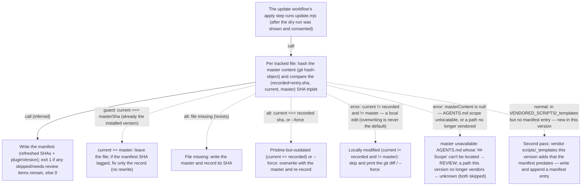

# Flow: update-classification — the (recorded, current, master) triplet

> One named scenario: **update classifies each tracked file from its
> (recorded, current, master) SHA triplet and applies the one safe action.**
> The diagram + tables below the marker are *generated* from the `flow_*`
> frontmatter by `wiki-flow-render.mjs` — never hand-edit them. Anchors live in
> the tables, not the diagram. Schema + ladder: `references/flow.md`.

## Scenario

`update.mjs` exists to bring a repo's vendored repolore layer up to the
installed plugin version **without ever clobbering a deliberate local edit**.
The safety comes from one recorded fact: `.repolore/manifest.json` stores the
git **blob SHA** each vendored file had when it was last written (ADR-001). For
every tracked file the script forms a triplet — `recorded` (the manifest's
`entry.sha`), `current` (the working-tree blob), and `master` (the installed
plugin's copy, hashed on the fly with `git hash-object`) — and the *relationship
between the three* fully determines the action. No diffs, no heuristics: a file
is touched only when the triplet proves it is safe to.

The decision (`classify`) forks six ways: already-current (record fixed if it
lagged), missing (restored), pristine-but-outdated (regenerated), **locally
modified (skipped** — the user must opt in with `--force <path>`), master
unavailable (reported for review), and a sibling pass for scripts/templates this
version adds that the manifest predates entirely (added). After the per-file
loop the refreshed manifest and `pluginVersion` are written, and the exit code
reflects whether any skip/review items still need a human.

<!-- FLOW-RENDER:START — generated from flow-meta; do not hand-edit (run wiki-flow-render.mjs) -->

| # | Step | Actor | Anchor |
|---|------|-------|--------|
| 1 | invoke — The update workflow's apply step runs update.mjs (after the dry-run was shown and consented) | update-skill | `references/update.md` — `scripts/update.mjs` |
| 2 | classify — Per tracked file: hash the master content (git hash-object) and compare the (recorded=entry.sha, current, master) SHA triplet | update | `scripts/update.mjs` — `if (current === masterSha)` |
| 3 | up-to-date — current == master: leave the file; if the manifest SHA lagged, fix only the record (no rewrite) | update | `scripts/update.mjs` — `report.manifestFixed.push` |
| 4 | restore — File missing: write the master and record its SHA | update | `scripts/update.mjs` — `report.restored.push` |
| 5 | regenerate — Pristine-but-outdated (current == recorded) or --force: overwrite with the master and re-record | update | `scripts/update.mjs` — `report.updated.push` |
| 6 | skip-modified — Locally modified (current != recorded and != master): skip and print the git diff / --force <path> hint | update | `scripts/update.mjs` — `report.skippedModified.push` |
| 7 | needs-review — master unavailable: AGENTS.md whose '## Scope' can't be located → REVIEW; a path this version no longer vendors → unknown (both skipped) | update | `scripts/update.mjs` — `report.needsReview.push` |
| 8 | add-new — Second pass: vendor scripts/_templates this version adds that the manifest predates — write and append a manifest entry | update | `scripts/update.mjs` — `report.added.push` |
| 9 | persist — Write the manifest (refreshed SHAs + pluginVersion); exit 1 if any skipped/needs-review items remain, else 0 | update | `scripts/update.mjs` — `process.exit(attention` |

**Edges** — each `verified` hop cites the call site in the caller and names the callee:

| From → To | Kind | Evidence | Call site | Callee |
|-----------|------|----------|-----------|--------|
| invoke → classify | call | verified | `references/update.md:41` — `scripts/update.mjs` | `update.mjs` |
| classify → persist | call | inferred | — | — |

**Branches** — alternative and error paths:

| At → To | Kind | Condition | Cited at |
|---------|------|-----------|----------|
| classify → up-to-date | guard | current === masterSha (already the installed version) | `scripts/update.mjs:134` — `if (current === masterSha)` |
| classify → restore | alt | file missing (!exists) | `scripts/update.mjs:137` — `} else if (!exists) {` |
| classify → regenerate | alt | current === recorded sha, or --force <path> | `scripts/update.mjs:140` — `current === entry.sha || forced.has(rel)` |
| classify → skip-modified | error | current != recorded and != master — a local edit (overwriting is never the default) | `scripts/update.mjs:144-146` — `locally modified` |
| classify → needs-review | error | masterContent is null — AGENTS.md scope unlocatable, or a path no longer vendored | `scripts/update.mjs:127-129` — `if (master === null)` |
| classify → add-new | normal | in VENDORED_SCRIPTS/_templates but no manifest entry — new in this version | `scripts/update.mjs:154` — `if (manifest.generatedFiles.some((f) => f.path === rel)) continue;` |

<!-- FLOW-RENDER:END -->

## Notes

**Why one edge is `verified` and the rest of the structure is branches.** The
only genuine *call* in this flow is the trigger: `references/update.md` literally
runs `update.mjs` (cited in the caller's own text, naming the callee — the
directional grade). Everything `update.mjs` does internally is a **decision
tree**, not a call chain, so the six outcomes are modelled as `flow_branches`
off `classify`, each citing the exact `if`/`else` fork in the code. The
`classify → persist` hop is honest statement-sequence (the manifest is written
after the loop), so it is marked `inferred` rather than dressed up as a call —
the ladder's whole point (`references/flow.md`). One verified of two edges keeps
the page above the sub-50% evidence floor that would otherwise cap it at
`structural`.

**`add-new` is a second pass, shown as a sibling outcome.** It is not literally
a branch *inside* the per-file `if/else`; it is a separate loop (`update.mjs`
after the classification loop) over `VENDORED_SCRIPTS` / `_templates` entries the
manifest has no record of. It is drawn as a `normal` fork of `classify` because,
schematically (arc42 §6), it is the sixth kind of change update applies — the
case with *no recorded SHA at all*. The cited line is the guard that decides
add-vs-skip.

## Completeness

`flow_asserts_complete: true` — this page reaches the top **`set-validated`**
tier. Because `update.mjs` is a closed world (every disposition is a
`report.<key>.push` call site), a user-space set-equality extractor rebuilds the
outcome set straight from the code and `wiki-flow-check.mjs` set-compares it
against the six branches above. The extractor is
[`.repolore/validators/update-classification-seteq.mjs`](../../../.repolore/validators/update-classification-seteq.mjs),
registered under `validators:` in `wiki.config.yml` (ADR-007 / `references/flow.md`).
With `flow_asserts_complete: true`, a **new disposition added to `update.mjs`
that nobody writes into this flow becomes a hard failure** — the only check that
catches an omitted branch. This is repolore's reference extractor: the worked
example a target repo copies for its own closed-world tool flows (open-world
request/async flows honestly stay at `branch-audited`).
